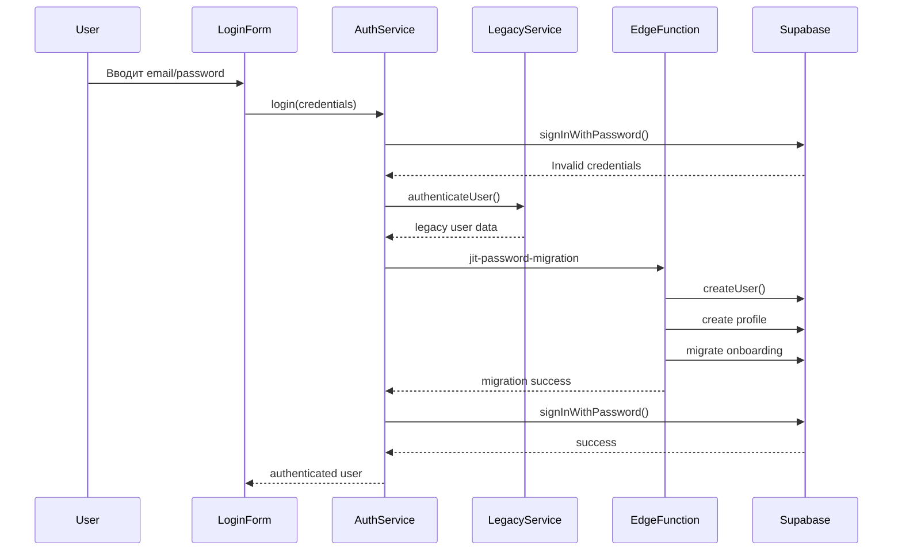

# JIT (Just-In-Time) Миграция Паролей

## Обзор

JIT миграция позволяет пользователям из старой системы автоматически мигрировать в новую Supabase-систему при первом входе, используя свои существующие учетные данные.

## Архитектура

### Компоненты системы:

1. **Legacy Auth Service** (`src/services/legacyAuthService.ts`)
   - Проверяет учетные данные в старой системе
   - Поддерживает localStorage и API интеграции

2. **Supabase Edge Function** (`supabase/functions/jit-password-migration/index.ts`)
   - Создает нового пользователя в Supabase
   - Мигрирует профильные данные и онбординг
   - Логирует процесс миграции

3. **Enhanced Auth Service** (`src/services/authService.ts`)
   - Интегрирован с JIT миграцией
   - Автоматически пытается мигрировать при неудачном логине

4. **Migration Monitor** (`src/components/admin/MigrationMonitor.tsx`)
   - Отслеживает статистику миграций
   - Показывает детали успешных и неудачных миграций

## Процесс миграции



## Настройка

### 1. Legacy Auth Service

Обновите `checkLegacyAPI` метод в `legacyAuthService.ts`:

```typescript
private async checkLegacyAPI(email: string, password: string): Promise<LegacyAuthResult> {
  const response = await fetch('https://your-legacy-api.com/auth', {
    method: 'POST',
    headers: { 'Content-Type': 'application/json' },
    body: JSON.stringify({ email, password })
  });

  if (response.ok) {
    const userData = await response.json();
    return {
      success: true,
      user: {
        id: userData.id,
        email: userData.email,
        first_name: userData.firstName,
        last_name: userData.lastName,
        role: userData.role || 'patient',
        // ... другие поля
      }
    };
  }

  return { success: false, error: 'Invalid credentials' };
}
```

### 2. База данных

Таблица `migration_audit_log` уже создана для отслеживания миграций:
- Логирует все попытки миграций
- Сохраняет детали ошибок
- Включает метаданные о мигрированных данных

### 3. Edge Function

Edge Function автоматически развернется. Убедитесь, что в Supabase настроены необходимые секреты:
- `SUPABASE_URL`
- `SUPABASE_SERVICE_ROLE_KEY`

## Безопасность

### Меры безопасности:
- ✅ Rate limiting для предотвращения атак
- ✅ Аудит лог всех миграций
- ✅ Проверка существующих пользователей
- ✅ Очистка legacy данных после миграции
- ✅ RLS политики для защиты данных

### Рекомендации:
1. Настройте HTTPS для legacy API
2. Используйте strong passwords для новых пользователей
3. Регулярно мониторьте лог миграций
4. Настройте алерты для неудачных миграций

## Мониторинг

### Migration Monitor компонент показывает:
- Общую статистику миграций
- Детали успешных миграций
- Информацию об ошибках
- Временные метки всех событий

### Доступ к мониторингу:
Только администраторы могут просматривать данные миграций через RLS политики.

## Тестирование

### Локальное тестирование:
1. Добавьте тестовые данные в localStorage:
```javascript
localStorage.setItem('eva_user_data', JSON.stringify({
  email: 'test@example.com',
  first_name: 'Test',
  last_name: 'User',
  role: 'patient'
}));
```

2. Попробуйте войти с этими данными
3. Проверьте, что миграция прошла успешно

### Production тестирование:
1. Создайте тестового пользователя в legacy системе
2. Убедитесь, что API интеграция работает
3. Проверьте логи миграций

## Troubleshooting

### Частые проблемы:

**Миграция не работает:**
- Проверьте, что Edge Function развернута
- Убедитесь, что legacy API доступен
- Проверьте логи в Supabase

**Пользователь уже существует:**
- Система автоматически обнаруживает существующих пользователей
- Показывает соответствующее сообщение

**Ошибки аутентификации:**
- Проверьте формат данных от legacy API
- Убедитесь, что все обязательные поля присутствуют

### Логи и отладка:
- Все этапы миграции логируются в консоль
- Migration audit log содержит детальную информацию
- Security audit log дублирует важные события

## Развертывание

JIT миграция готова к использованию:
- ✅ Legacy Auth Service создан
- ✅ Edge Function развернута
- ✅ База данных настроена
- ✅ UI обновлен для поддержки миграции
- ✅ Мониторинг настроен

Система автоматически активируется при неудачных попытках входа через Supabase.